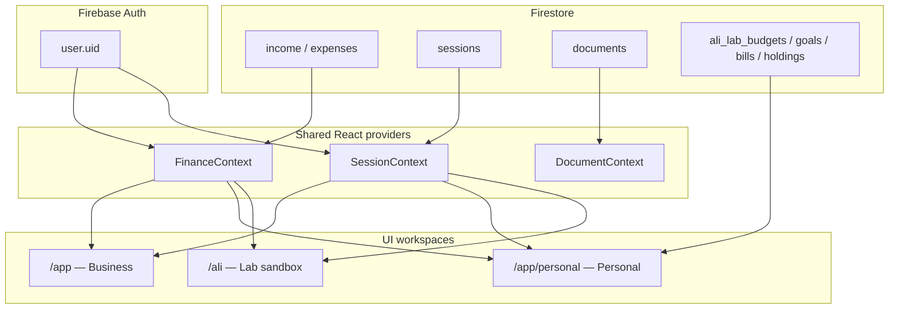

# Personal ↔ Business Link — Super Prompt

Use this when wiring **Paystack Personal** (household finance) to **Paystack Business** (`/app`) so clients see one linked account with two workspaces.

---

## Goal (one sentence)

**Same Firebase user, same ledger (income/expenses/sessions/documents), two UIs:** Business for payroll/VAT/POS, Personal for household budget/goals/bills — with a one-click workspace switch.

---

## Data model (already shared — do not duplicate)

| Layer | Source | Used by |
|-------|--------|---------|
| Income & expenses | `FinanceContext` → Firestore `income` / `expenses` (`restaurantId == uid`) | `/app` + `/app/personal` + `/ali` |
| Sessions | `SessionContext` | All workspaces |
| Documents / AI upload | `DocumentContext` | Business tabs; rows flow into Personal via classification |
| Personal-only settings | `ali_lab_*` collections (`budgets`, `goals`, `bills`, `holdings`) | Personal UI (`restaurantId == uid`) |

**Rule:** Personal **never** creates a second ledger. It **classifies** the same rows into household buckets (`personalCategories.ts`).

---

## Routes

| URL | Workspace | UI shell |
|-----|-----------|----------|
| `/app` | Business | `RestaurantDashboard` (existing) |
| `/app/personal` | Personal | redirect → `/app/personal/budgeting` |
| `/app/personal/:featureId` | Personal | `PersonalPlanShell` + feature panel |
| `/ali/*` | Lab sandbox | Same panels, password gate — keep for experiments |

Feature IDs: `budgeting`, `forecasting`, `goals`, `investments`, `bill-reminders` (+ lab-only prototypes under `/ali`).

---

## Agent instructions (copy-paste)

```
You are linking Paystack Personal and Business workspaces in production /app.

Rules:
1. ONE ledger: reuse FinanceContext, SessionContext, DocumentContext — never fork Firestore paths for income/expense.
2. Personal views use useLinkedLedger() (household totals + filtered rows) and personalCategories.ts for bucket mapping.
3. Business views keep payroll, VAT, suppliers, POS — unchanged semantics in RestaurantDashboard.
4. Workspace switcher:
   - Business sidebar → link to /app/personal/budgeting ("Personal finances")
   - Personal sidebar → link to /app ("Business dashboard")
5. Session selector in Personal must read/write the SAME SessionContext as Business (already true if both mount under PlatformPage providers).
6. Personal feature panels live in client/src/ali-lab/features/ — import into /app/personal, do not duplicate logic.
7. i18n: personal in /app uses LabLanguageProvider (en/fr/de/it) until merged into LanguageContext.
8. Do NOT remove /ali lab until user approves; lab stays for prototypes (automation, shared-access, offline, de-it).
9. Plan gating: when promoting, add entitlements in shared/planCatalog.ts if personal is a paid tier.
10. Run pnpm build before finishing.

When extending:
- New personal screen → add route /app/personal/<id>, register in personalPlanNav.ts, reuse PersonalPlanShell.
- New business screen → RestaurantDashboard tab only; do not mix household categories into business KPIs.
- Cross-workspace deep links: /app/documents?session=… from personal "View source transaction" (future).

Test checklist:
- Sign in → add expense in /app → open /app/personal/budgeting → same amount in classified category.
- Change session in Business → Personal reflects same session filter.
- Budgets/goals saved in Firestore appear after refresh in both workspaces (same uid).
```

---

## Architecture diagram



---

## Personal vs Business presentation

| Metric | Business `/app` | Personal `/app/personal` |
|--------|-------------------|---------------------------|
| Top KPIs | Income, expenses, payroll, VAT, balance | Income, expenses, savings, balance, savings rate |
| Categories | BILLS, SUPPLIERS, PAYROLL, PAYROLL_TAXES, OTHER | Bills, rent, groceries, going out, shopping, savings |
| Zero-based budget | N/A | Budget panel |
| POS / revenue tab | Yes | Hidden |
| Document upload | Full processor | Link to business or shared upload (future) |

---

## Promotion phases

1. **Phase 1 (current):** `/app/personal/*` routes + workspace switcher + shared ledger hook ✅ scaffold
2. **Phase 2:** Session/month picker in Personal header synced with global session state; remove duplicate month state
3. **Phase 3:** i18n merge (LabLanguage → LanguageContext); rename `ali_lab_*` → `personal_*` collections when stable
4. **Phase 4:** Plan entitlements; marketing copy for household + business bundle
5. **Phase 5:** Retire `/ali` for features marked `promoted` in featureRegistry.ts

---

## Files to know

| Path | Role |
|------|------|
| `client/src/cafe/hooks/useLinkedLedger.ts` | Shared ledger hook (business + personal) |
| `client/src/ali-lab/personal-plan/` | Personal UI shell & theme |
| `client/src/ali-lab/features/*.tsx` | Personal feature panels |
| `client/src/ali-lab/personalCategories.ts` | Household classification |
| `client/src/pages/PersonalAppPage.tsx` | Production personal workspace |
| `client/src/pages/PlatformPage.tsx` | Provider stack + business/personal router |
| `client/src/cafe/components/RestaurantDashboard.tsx` | Business workspace |

---

## Environment

```bash
pnpm dev
# Business:  http://localhost:3000/app
# Personal:  http://localhost:3000/app/personal/budgeting
# Lab:       http://localhost:3000/ali-gate
```

---

## Related docs

- `docs/ALI_LAB_SUPER_PROMPT.md` — lab features & promotion gate
- `docs/PERSONAL_PLAN_STITCH_SUPER_PROMPT.md` — Personal UI design (Stitch)
